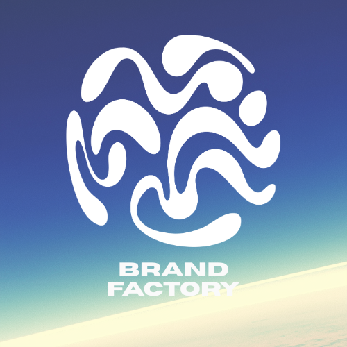

<p align="center">
  
</p>

<h1 align="center">BrandFactory</h1>

<p align="center">
  <strong>The open-source Brand Operating System.</strong><br/>
  One brand context. Endless consistent creative.
</p>

<p align="center">
  <em>Self-hosted · Privacy-first · Provider-agnostic · No lock-in</em>
</p>

---

## The problem

Brand context lives in too many places — a deck in Figma, a voice doc in
Notion, personas on a slide somewhere, campaign notes in Slack, a dozen
half-remembered rules in the founder's head.

Every time someone opens a generic AI tool to draft an ad, name a product,
or plan a week of posts, they re-explain the brand from scratch — or skip
it, and get generic output that doesn't sound like the brand at all.

## The idea

**Define your brand once. Every creative surface inherits it automatically.**

- 🏠 **Workspaces** are the living home for each brand — audience, voice,
  positioning, visuals, messaging, and anything else that matters.
- 🎨 **Projects** are where work happens: a split-screen workspace with an
  agent chat on one side and a freeform multimodal canvas on the other.
- 🔁 **Ideate → Iterate → Finalize.** Brainstorm with full brand context,
  pin the ideas worth keeping, shortlist the winners, and promote them back
  into your brand guidelines.

There's no dedicated "naming agent" or "copy agent." One brainstorming
surface produces taglines, content calendars, packaging concepts, or
anything else — because the brand context always travels with it.

## Who it's for

- **Solo founders** shaping a brand from scratch without hiring an agency.
- **In-house marketers** juggling multiple brands or sub-brands who need
  consistency without rebuilding context every time they open an AI tool.
- **Creators** whose brand is themselves, and who want their voice baked
  into everything they make.
- **Small agencies** managing a portfolio of client brands, with each
  brand's context cleanly separated and instantly available.

## Why open source

- **Self-hosted.** Runs on your own infrastructure. Brand data stays where
  you put it.
- **Bring your own LLM.** OpenRouter, Anthropic, OpenAI, or local models
  via Ollama — mix and match per workspace.
- **Modular at the seams.** Database, storage, auth, and LLM providers sit
  behind thin ports. Defaults work; swap them freely.
- **No vendor lock-in.** Standard data formats, exportable at any time.
  No recurring fees.

## Status

> 🚧 **Pre-alpha — scaffolding in progress.**
>
> The vision, architecture, and foundational packages are landing phase by
> phase. Follow the [changelog](docs/changelog.md) to track what's shipped.

**Shipped so far:** repo foundation · shared domain types · Postgres schema
& query layer · adapter ports (auth, storage, realtime, LLM) · Hono server
with streaming agent + realtime WS · Vite + React 19 frontend with
split-screen project workspace, brand editor, settings, and realtime
canvas.

**Up next:** Docker-compose dev image (Phase 8), Playwright e2e (Phase 9),
standardized project templates.

## Running locally

```bash
docker compose -f docker/compose.yaml up -d       # Postgres
pnpm -F @brandfactory/db db:migrate               # schema
cp .env.example .env                              # server env
cp packages/web/.env.example packages/web/.env    # frontend env
pnpm dev                                          # server :3001 + web :5173
```

Full frontend setup (auth provider, Supabase keys, local-dev token flow,
LLM provider choices) lives in
[`packages/web/README.md`](packages/web/README.md). The Phase-8 README
overhaul will fold those notes into this file.

## How it'll work (sneak peek)

Inside a project, the canvas is freeform and multimodal: Notion-style rich
text, drag-and-drop images, moodboard snippets, links. Every element can
be **pinned** to build a shortlist. The agent is live-aware of everything
on the canvas — so prompts like _"give me five more like the pinned ones"_
or _"turn this moodboard into three visual directions"_ just work.

Projects can be fully freeform, or use **standardized templates** for
common jobs. The first template is a minimalist social media content
calendar — calendar view, agent tuned for content ideation, drag-and-drop
scheduling. More templates welcome.

## Explore the vision

- 📖 [`docs/vision.md`](docs/vision.md) — the full product vision
- ✨ [`docs/highlevel-vision.md`](docs/highlevel-vision.md) — the elevator pitch
- 🏛 [`docs/architecture.md`](docs/architecture.md) — technical blueprint
- 🗺 [`docs/executing/scaffolding-plan.md`](docs/executing/scaffolding-plan.md) — phase-by-phase plan
- 📜 [`docs/changelog.md`](docs/changelog.md) — what's shipped, and why

## Contributing

BrandFactory is early, and the best ways to help right now are the
non-code ones:

- **Read the vision docs and push back.** If a decision doesn't hold up,
  we'd rather revise it before it's load-bearing.
- **Sanity-check the scaffolding plan.** Phase ordering, missing pieces,
  smoke checks that don't actually prove what they claim — all fair game.
- **Build with it** once the first runnable phases land, and file what
  breaks.

Formal contribution guidelines (code style, PR flow, governance) arrive
alongside CI.

## Tech stack

TypeScript end-to-end. Vite + React + Tailwind + shadcn on the frontend,
Hono + Drizzle + Postgres on the backend, Vercel AI SDK for LLM plumbing.
Full rationale in [`docs/architecture.md`](docs/architecture.md).

## License

[MIT](LICENSE) — yours to use, fork, and self-host.
